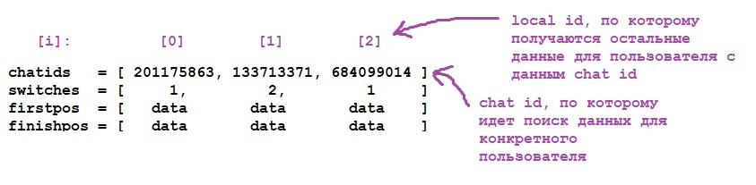
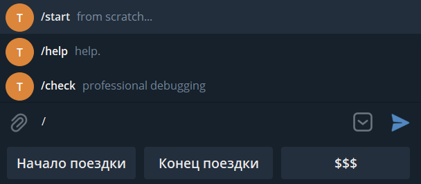

# Design Document
## Функциональные детали
- Бот создан для поиска наиболее выгодного приложения такси
- Минимальное количество функций, доступных пользователю, для облегчения работы
- Реализован API Яндекс.Такси, т.к. остальные сервисы либо не предоставили свой интерфейс ввиду отсутствия ИП/ООО, либо не имеют такого вовсе.

## Структура проекта
### Общая логика
- Пользователь последовательно отправляет боту статичные геопозоиции. 
- Бот запоминает мировые координаты позиций, после чего формирует GET запрос и отправляет его на сервер такси. 
- Ответ от сервера приходит в формате JSON, из которого по ключевым данным получается цена поездки
- По ранее полученным мировым координатам формируется гиперссылка с быстрым доступом к назначенному маршруту в приложении.

### Логика хранения данных
Существуют 4 безразмерных списка:
| Название | Функционал |
| -------------- | -------------- |
| chatids | Хранение chat id пользователей с целью дальнейшего нахождения локального индекса и работы с данными |
| switches | Переключение между внесением стартовой и конечной позицией |
| startpos | Геоданные стартовой точки в строковом формате |
| finishpos | Геоданные финишной точки в строковом формате |

Для доступа к данным используется функция findlocalid(), на вход которой передаётся chat id текущего диалога. Функция проверяет, встречался ли такой id раньше в списке chatids, если нет - добавляет его в список с помощью list.append(). Затем индекс chat id из этого списка возвращается как результат, и по данному локальному индексу остальные функции оперируют с данными в списках.

### Функции
| Название | Функционал |
| -------------- | -------------- |
| send_welcome | Обработка команды /start - приветствие |
| send_help | Обработка команды /help - помощь |
| check | Дебаггинг в консоли сервера |
| location | Обработка отправленной пользователем геопозиции |
| buttons | Функционал кнопок в меню |
| switchto1 | Меняет переменную switches по индексу localid, позволяя записывать геоданные в startpos|
| switchto2 | Аналогично switchto1, но с finishpos |
| findlocalid | Находит локальный индекс данного chat id для работы с данными в списках |
| getcost | Формирование строки GET-запроса и обработка JSON, возвращает стоимость поездки |
| poserror | Обработка ситуаций с запросом стоимости при отсутствии геоданных |
| createlink | Создание гиперссылки для приложения такси |
| formatresult | Форматирование текста стоимости всех такси |
| keyborad | Keyboard markup |

### Интерфейс
Реализован с помощью кнопочного меню Telegram. Функионал:
- Выбор типа точки - задать начальную или конечную точку маршрута.
- Получить данные о стоимости.

## План выполненния
- Основная работа с Telegram - создание обработки геопозиций, создание интерфейса, системы хранения данных
- Работа с API Яндекса - GET-запросы, работа с JSON
- Финальные штрихи - настройка вывода, ответов, внешний вид и т.д.
